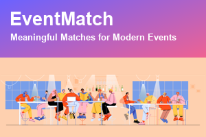

# EventMatch 🤝

> **Meaningful Matches for Modern Events.**
> A mobile‑first networking companion for tech conferences & meetups — built with **KendoReact**
> for the hackathon, since migrated to a custom, dependency‑free UI kit.

**🌐 Live:** https://margaritasi.github.io/event-match/ · **🎬 Demo video:** _(add link)_



---

## The problem
Networking is the #1 reason people attend events — and the most broken part of the experience.
You meet someone great, swap contacts, and a week later you've forgotten who they were and why you
should follow up (the [Ebbinghaus forgetting curve](https://en.wikipedia.org/wiki/Forgetting_curve):
we lose ~70% of new info within a day). At a 50–400 person event you also can't tell **who you
should** meet — and organisers, sponsors and communities have no shared tooling.

## The idea
EventMatch closes the whole loop — **Discover → Connect → Capture → Follow up → Keep in touch** — in
one app, organised into **Me · Meet · Event**:

- 🧠 **Smart matching** by shared interests **+** concrete skills, with **complementary intents**
  (hiring ↔ open‑to‑work, co‑founder ↔ co‑founder…). Scales to hundreds of attendees.
- ⚡ **Quick Capture → Tasks** — note a person + next step after a chat; get a dated **follow‑up task**
  (export to Apple/Google Calendar, optional email reminder). *Never forget a follow‑up.*
- 🔗 **Contact exchange with no backend** — your QR / **share link** encodes your card; the other
  person opens it and connects. Two judges can match across two devices, server‑free.
- 🤝 **Connections** — everyone you matched with, contacts unlocked.
- 🏘 **Groups** — lasting communities (stack/role/interest) with a meet time, place & Discord.
- 📅 **Schedule & 🗺 Venue Map** — agenda with free‑time gaps that suggest who to meet.
- 📊 **Organiser Dashboard** — top interests, match potential, zone heatmap (all computed live).
- 🏢 **Sponsors** — badge‑drop lead capture + ROI dashboard.
- 🏆 **Gamification** — points, badges & leaderboard for genuinely useful actions.

## Tech stack
- **React 19 + TypeScript + Vite**
- Custom, dependency‑free UI kit in `src/ui/` (Buttons · Inputs · Cards · Dialogs) — the app was
  **originally built on KendoReact** for the Kendo UI challenge, then migrated off the dependency
- `qrcode.react`, `localStorage` persistence (no backend by design)
- Pure‑TypeScript domain logic in `src/lib/` (matching · intent · capture · schedule · gamification)
- **58 unit tests** (Vitest)
- **CI/CD:** GitHub Actions → GitHub Pages

## Run locally
```bash
npm install
npm run dev      # http://localhost:5174
npm test         # 58 unit tests
npm run build    # production build → dist/
```

## Deploy
Push to `main` → GitHub Actions builds and deploys to GitHub Pages automatically.

## 📄 Full hackathon submission
The complete write‑up (problem, idea, deep‑dive, challenges, monetization, next steps, FAQ) lives in
**[SUBMISSION.md](SUBMISSION.md)**. The video script is in **[VIDEO_SCRIPT.md](VIDEO_SCRIPT.md)**.

## Links
- 🌐 Live app — https://margaritasi.github.io/event-match/
- 💻 Code — https://github.com/MargaritaSI/event-match
- 🎬 Video — _(add link)_

_Built solo with KendoReact (live build since migrated to a custom UI kit) for the “improve how events are created or experienced” challenge._
